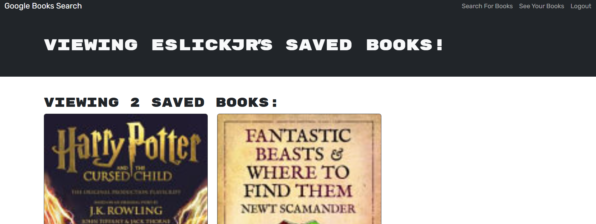

# gitBooks
  
  ## Description
  This allows you totraverse a list of booksand add them to a list for future reads. When you've finished a book, you can remove it from the list. This prevents you from forgetting books you wanted to read. 
  ## Table of Contents
  - [Installation](#installation)
  - [Usage](#usage)
  - [Contribution](#contribution)
  - [Test](#test)
  - [License](#license)
  - [Questions](#questions)
  ## Installation
  You'll need to pull down the git repository and run npm i, following by npm run build, and finally npm run develop. This will spin up your local environment and should take you to the localhost page. Alternatively you can visit the live deploy at https://gitbooks.onrender.com/
  ## Usage
  You login or sign up. You then search books by anything you'd like such as category or name. You can then get a brief description of the book and beneath will be a button to save the book. If you save the book, you can access it via your saved books in the navbar. You can then choose to remove the book if you've completed reading it.
  ## Contribution
  N/A
  ## Test
  N/A
  
  
  ## Questions
  For questions, please contact me:
  - GitHub: eslickjr
  - Email: joshuareslick@gmail.com
  